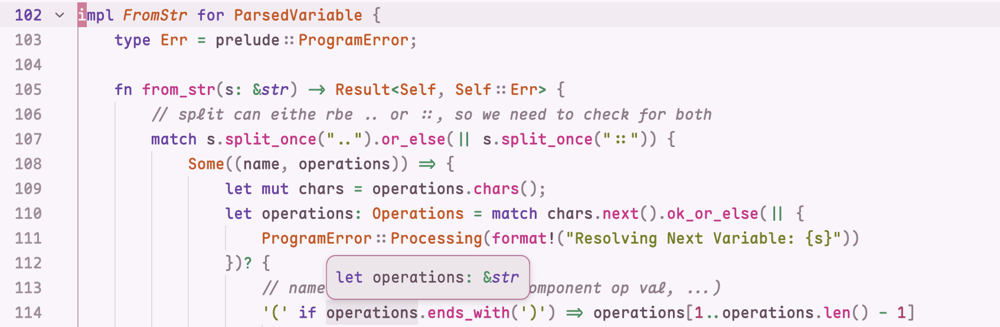

# Bratppuccin Theme
`variants: [Espresso, Shot]`

A theme for brats and coffee lovers, influenced by the cute, cozy, and comferting colors of coffee and inspired by the Catppuccin Color Pallete.

## Preview

### Espresso

### Shot

## Installation
1. Copy blossom.json to ~/.config/zed/themes/
2. Open Zed and navigate to Settings -> Theme -> Bratppuccin
